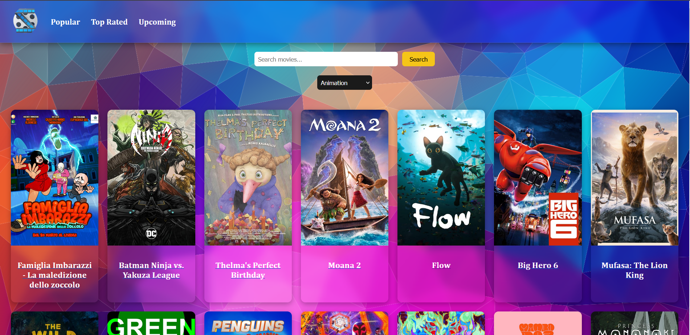
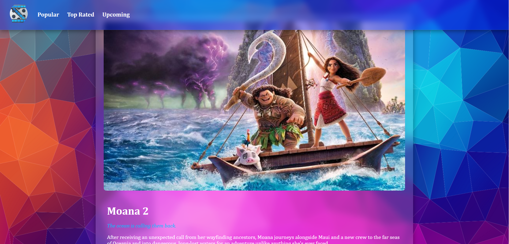

# 🎬 Movie Explorer

A sleek, responsive React app that allows users to explore popular, top-rated, and upcoming movies using **The Movie Database (TMDb) API**. Features include movie search, genre filtering, detailed movie info, cast display with slider, and favorites saved in localStorage.

---

## 🚀 Features

- 🔍 **Search Movies** by title
- 🎭 **Filter by Genre**
- ⭐ **Popular / Top Rated / Upcoming** categories
- 🎞️ **Detailed Movie Info** (plot, rating, release date)
- 👥 **Cast Slider** with actor images
- ❤️ **Favorites** saved to `localStorage`
- 📱 **Fully Responsive** and mobile-friendly UI
- 🎨 Beautiful UI with blurred backgrounds and custom scrollbars

---

## 🧩 Technologies Used

- **React** (Hooks, Router)
- **Axios** for API requests
- **TMDb API** for movie data
- **CSS** with blur effects and custom scrollbars

---

## 📷 Screenshots

| Home Page | Movie Details | Cast Slider |
|-----------|----------------|-------------|
|  |  |  |

---

## 📦 Installation

1. **Clone the repository:**
   ```bash
   git clone https://github.com/helloitsmeabhi/movie-app.git
   cd movie-app
   ```

2. **Install dependencies:**
   ```bash
   npm install
   ```

3. **Set up TMDb API Key:**

   Add a API key in `.env` file in the root directory:
   ```
   REACT_APP_TMDB_API_KEY=your_tmdb_api_key_here
   ```

4. **Run the app:**
   ```bash
   npm start
   ```

5. Visit [http://localhost:3000](http://localhost:3000)

---

## 🗂️ Project Structure

```
src/
├── assets/
│   └── triangles.png
├── components/
│   ├── Header.js
│   ├── MovieList.js
│   ├── MovieDetails.js
│   └── ...
├── App.js
├── index.css
└── index.js
```
---
🚀Deployed Site
---
```
https://helloitsmeabhi.github.io/movie-app
```
---

## 🌐 Credits

- Data provided by [TMDb API](https://www.themoviedb.org/documentation/api)
